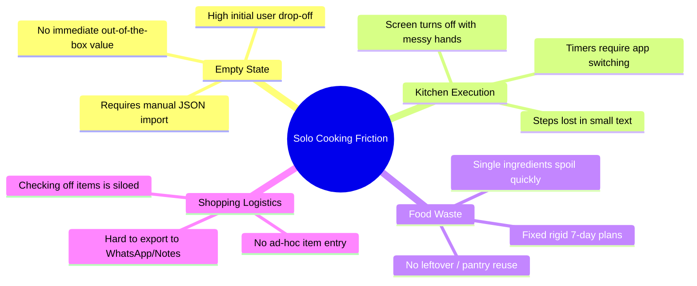

# Solochef Strategic Product & Technical Roadmap 🍱
*Solo Chef's Dabba: Zero-Crash Meals for One*

---

## 1. Executive Summary & Vision

**Solochef** is engineered around a singular core problem: **making healthy, energizing cooking sustainable for people living and eating solo.**

While generic recipe apps focus on 4-person family dinners or complex culinary projects, Solochef focuses on the daily operational reality of the solo cook:
- Minimizing food waste and half-used perishable groceries.
- Preventing the "3 PM afternoon slump" with high-protein, fiber-first meals ("Anti-Slump Hack 🛡️").
- Eliminating cooking friction: under 20 minutes, 1 pan, minimal cleanup.
- Removing decision fatigue when opening an empty fridge after a long workday.

---

## 2. The Solo Cooking Friction Space

---

## 3. Prioritized Feature Matrix

Solutions evaluated across **User Delight & Daily Utility** vs. **Implementation Complexity & Diff Size** (following the Ponytail Senior Dev principle: shortest working diff, native APIs first).

| Priority | Feature Solution | Impact / Delight | Complexity | Core Tech / APIs |
| :--- | :--- | :--- | :--- | :--- |
| **P1** | **1-Click Curated Dabba Presets** | Very High | Low | Static typed presets, zero network calls, 100% offline |
| **P1** | **Hands-Free Kitchen Cook Mode** | Very High | Low–Med | Web Screen Wake Lock API, Web Audio API timer, Framer Motion |
| **P2** | **Smart Grocery Export & Quick Add** | High | Low | Web Share API / Clipboard API, LocalStorage |
| **P2** | **Single-Meal Swap & Re-Roll** | High | Medium | In-place meal mutation, Gemini swap prompt generator |
| **P3** | **1-Page Fridge-Magnet Print Sheet** | Medium–High | Low | Pure CSS `@media print` styling, zero runtime dependencies |
| **P3** | **"Pantry Rescue" Leftover Matcher** | High | Medium | Ingredient matcher utility + Gemini leftover prompt |
| **P4** | **"Cook Once, Eat Twice" Batch Scaler** | Medium | Low–Med | Dynamic ingredient parser & multiplier (1x vs 2x) |
| **P4** | **Anti-Slump Nutritional Indicators** | Medium | Low | Macro badges (Protein, Fiber, Slump Risk Index) |

---

## 4. Deep Architectural Specifications

### 4.1. 1-Click Curated "Dabba Presets" (Instant Onboarding)
- **Problem**: When a user first opens Solochef, they encounter a blank state with "No meal plan found" and must copy-paste JSON from ChatGPT/Claude.
- **Solution**: Provide 4 pre-built, nutritionist-vetted starter meal plans available right on the home screen and in the Import tab:
  1. ⚡ **Anti-Slump High Energy**: 15-minute high-protein, fiber-first meals designed for sustained mental focus.
  2. 🥬 **Solo Vegetarian Express**: Minimal ingredient overlap, budget-friendly plant power.
  3. 🍳 **One-Pan Minimal Cleanup**: Every meal uses only 1 skillet, pot, or sheet pan; zero dish piles.
  4. 🌏 **Global Solo Classics**: Mediterranean chickpea bowls, shakshuka, quick egg noodles, garlic salmon.
- **Architecture**:
  - Store static plans in `src/data/presets.ts`.
  - Validate at compile-time using `validateMealPlan`.
  - Provide a 1-tap "Load Preset" action that updates `localStorage` and populates the planner immediately.

### 4.2. Hands-Free Kitchen Cook Mode
- **Problem**: While actively cooking, hands are coated in oil, water, or flour. Phone screens auto-lock after 30 seconds, recipes are hard to read at arm's length, and timers require leaving the app.
- **Solution**: A full-screen dedicated Cook Mode launched from any meal card:
  - **Native Screen Wake Lock**: Invokes `navigator.wakeLock.request('screen')` on mount to keep the display active throughout cooking, releasing lock on exit.
  - **Large Typography Step Cards**: Swipeable or 1-tap Next/Previous step navigation with high contrast and progress indicator.
  - **Integrated Step Timers**: Detects durations in steps (e.g. *"Sear salmon for 4 mins"*) and provides an immediate 1-tap countdown timer with synthesizer audio bell (Web Audio API) and vibration (`navigator.vibrate`).
  - **Step-Specific Ingredient Focus**: Highlights only the ingredients needed for the current step.

### 4.3. Smart Grocery Logistics (Share & Quick Add)
- **Problem**: When walking through a grocery store, toggling checkboxes in a web app can be cumbersome, and sending the list to a partner or housemate requires retyping.
- **Solution**:
  - **1-Tap Share to WhatsApp / Notes**: Formats remaining unchecked grocery items into a clean, categorized message using the Web Share API (`navigator.share`), falling back to clipboard copy.
  - **Quick Add Custom Item**: A clean input at the top of the Groceries tab to add miscellaneous household necessities (e.g., *"Olive oil"*, *"Paper towels"*).
  - **Clear / Reset Checked**: Quick 1-tap action to reset or archive completed items.

### 4.4. Single-Meal Swap & "Gemini Re-Roll"
- **Problem**: In real life, Tuesday night plans change, or you run out of an ingredient. Changing one meal currently requires manually re-importing the whole 7-day JSON.
- **Solution**:
  - A **"Swap Meal"** button on each meal card.
  - **Option A (Instant Swap)**: Select an alternative quick solo meal from the preset pool.
  - **Option B (Gemini Re-roll)**: Generates a specialized prompt asking Gemini: *"Suggest a 15-minute high-protein dinner to replace Garlic Herb Butter Salmon that uses ingredients already on my grocery list."*
  - Updates only the target day's meal slot, preserving the rest of the week.

### 4.5. 1-Page Fridge-Magnet / Print View
- **Problem**: Many solo cooks prefer a physical cheatsheet on the refrigerator or countertop.
- **Solution**:
  - A "Print Weekly Plan" button triggering `window.print()`.
  - Optimized `@media print` CSS delivering a clean, minimalist 7-day bento grid with meal names, prep alerts, and weekly shopping list formatted onto a single A4/Letter page.

---

## 5. Technical Implementation Roadmap

### Phase 1: Onboarding & Curated Presets (Immediate Win)
- Create `src/data/presets.ts` with 3 complete, validated 7-day plans.
- Update empty-state in `src/app/page.tsx` with preset selector cards.
- Add "Load a Preset" section to `src/components/ImportTab.tsx`.
- Automated test suite verifying preset loading, localStorage synchronization, and fallback resilience.

### Phase 2: Kitchen Cook Mode
- Implement `src/components/CookModeModal.tsx` with Wake Lock lifecycle management.
- Implement countdown timer utility with Web Audio synthesizer beep.
- Add "Start Cooking" entry point to `src/components/MealCard.tsx`.
- Vitest unit tests verifying step transitions, timer lifecycle, and Wake Lock acquisition/release.

### Phase 3: Smart Grocery Suite
- Implement `src/utils/groceryExport.ts` formatting unchecked items.
- Add Web Share / Clipboard copy button to Groceries header.
- Add ad-hoc item input form with local storage persistence.
- Add "Reset Checked Items" confirmation dialog.

### Phase 4: Single Meal Swap & Print View
- Implement meal replacement handler in `page.tsx`.
- Add "Swap Meal" dialog to `MealCard.tsx` with preset alternatives.
- Add print-only styles in `globals.css` for clean 1-page paper rendering.

---

## 6. Architectural Guardrails (ECC & Ponytail Senior Dev)

1. **Shortest Working Diff**:
   - Zero new NPM dependencies. All features use native browser APIs (`navigator.wakeLock`, `navigator.share`, `window.print`, `AudioContext`).
2. **React 19 & Next.js 16 Standards**:
   - Strict `'use client'` discipline only on interactive components.
   - Immutable state transitions without direct object mutations.
3. **PWA & Offline First**:
   - Every preset and core utility functions 100% offline via the registered service worker.
4. **TDD Quality Gate**:
   - All new utilities and component interactions backed by Vitest + React Testing Library suites maintaining $\ge 80\%$ test coverage.
