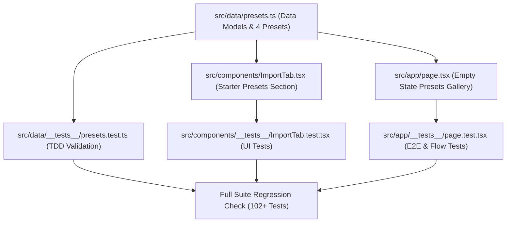

# Implementation Plan: Phase 1 — Curated Dabba Presets & Quick-Start Onboarding

## Executive Summary
Phase 1 eliminates Solochef's primary onboarding friction: the "empty state cold start". Currently, new users face an empty planner requiring manual LLM prompting and raw JSON pasting. Phase 1 provides **4 curated, nutritionist-vetted 7-day starter meal plans** available on the home screen empty state and within the Import tab for instant 1-click loading.

All presets are statically typed, bundled offline, and verified against `validateMealPlan` to guarantee zero runtime failures, zero network latency, and zero external dependencies.

---

## Technical Architecture & Design Decisions

### 1. Preset Data Design (`src/data/presets.ts`)
- **Structure**:
  ```typescript
  export interface PresetMeta {
    id: string;
    title: string;
    description: string;
    emoji: string;
    tag: string;
    prepTime: string;
    highlights: string[];
    data: MealPlanData;
  }
  ```
- **The 4 Curated Presets**:
  1. ⚡ **Anti-Slump High Energy**: 15-minute high-protein, fiber-first meals (e.g., 3-Egg Veggie Bhurji, Mediterranean Chickpea Bowl, Garlic Herb Butter Salmon).
  2. 🥬 **Solo Vegetarian Express**: Minimal ingredient overlap, budget-friendly plant power (Tofu Scramble, Spiced Lentil & Spinach Bowl, Paneer Tikka Skillet).
  3. 🍳 **One-Pan Minimal Cleanup**: Every meal uses only 1 skillet, pot, or sheet pan; zero sink pile-up (One-Skillet Shakshuka, 1-Pan Pesto Chicken & Veggies, Sheet-Pan Roasted Chickpeas & Sweet Potato).
  4. 🌏 **Global Solo Classics**: Vibrant global favorites scaled for one (Quick Kimchi Fried Rice, Greek Lemon Herb Bowl, 15-min Thai Basil Tofu/Chicken).

- **Data Integrity Constraints**:
  - Each preset contains all 7 days (`Monday` through `Sunday`).
  - Each day contains 3 meals (`Breakfast`, `Lunch`, `Dinner`).
  - Every meal contains structured arrays for `ingredients` and step-by-step `recipe` instructions.
  - Meal styling tokens conform to exact schema standards (`bg-orange-100`, `bg-green-100`, `bg-indigo-100`, etc.).
  - Complete categorized `groceries` list for the entire week.

### 2. Empty State Transformation (`src/app/page.tsx`)
- Replace the static "No meal plan found" message with a responsive, high-converting **"Pick Your Starter Dabba"** preset gallery.
- Each preset is displayed as an interactive card featuring:
  - Emoji + Title + Category tag.
  - Quick bullet highlights (e.g. "15m avg • High-protein • 1-pan").
  - 1-Tap "Load Preset" action.
- Uses `handleImportPlan` to:
  - Populate `mealDb`.
  - Persist to `localStorage.setItem('solochef_meal_plan', ...)`.
  - Automatically reset daily and grocery checklists.
- Maintains a discrete secondary link to the custom JSON import tab for power users.

### 3. Import Tab Integration (`src/components/ImportTab.tsx`)
- Add a new top section: **"Need Inspiration? Load a Starter Plan"**.
- Displays compact cards for the 4 presets with 1-click loading.
- Seamlessly integrates with the existing `onImport` callback and triggers the existing success toast.

---

## Dependency Graph & Implementation Order



---

## Detailed Task Breakdown

### Task 1: Curated Presets Data Engine
- **File**: `src/data/presets.ts`
- **Scope**: XS/S (1 file)
- **Acceptance Criteria**:
  - Exports `PRESETS: PresetMeta[]` containing all 4 validated presets.
  - Exports convenience lookup `PRESET_MAP: Record<string, PresetMeta>`.
  - All 4 presets contain full Monday–Sunday 3-meal schedules, recipe steps, quantified ingredients, and grouped groceries.
- **Verification**: TypeScript compiles cleanly with zero type errors.

### Task 2: Preset Data Validation Test Suite (TDD - RED/GREEN)
- **File**: `src/data/__tests__/presets.test.ts`
- **Scope**: S (1 test file)
- **Acceptance Criteria**:
  - Runs `validateMealPlan(JSON.stringify(preset.data))` across all 4 presets.
  - Asserts all 7 days exist with Breakfast, Lunch, Dinner.
  - Verifies recipe arrays have non-empty step strings and ingredients are present.
- **Verification**: `pnpm test src/data/__tests__/presets.test.ts` passes with 100% green assertions.

### Task 3: ImportTab Preset Selector
- **Files**: `src/components/ImportTab.tsx`, `src/components/__tests__/ImportTab.test.tsx`
- **Scope**: S (2 files)
- **Acceptance Criteria**:
  - Displays "Chef-Crafted Starter Plans" header and cards for each preset.
  - Clicking any preset invokes `onImport(preset.data)` and displays success feedback.
  - Maintains accessible touch targets ($\ge 44\text{px}$) and keyboard navigation.
- **Verification**: `pnpm test src/components/__tests__/ImportTab.test.tsx` passes.

### Task 4: Main Empty State Transformation
- **Files**: `src/app/page.tsx`, `src/app/__tests__/page.test.tsx`
- **Scope**: M (2 files)
- **Acceptance Criteria**:
  - When `!hasPlan`, renders the responsive preset gallery.
  - Clicking "Load Plan" populates `mealDb`, clears checked grocery/daily items, syncs with `localStorage`, and switches immediately to the populated Monday plan view.
  - Mobile ergonomics: minimum 44px hit targets, smooth transitions, overscroll containment.
- **Verification**: `pnpm test src/app/__tests__/page.test.tsx` passes.

### Task 5: Full System Verification & Quality Gate
- **Scope**: Project-wide
- **Acceptance Criteria**:
  - Full test suite execution: `pnpm test` passes with 0 failures.
  - Linter check: `pnpm lint` reports 0 errors and 0 warnings.
  - Build check: `pnpm build` completes with 0 errors.

---

## Risks & Mitigations

| Risk | Level | Mitigation Strategy |
| :--- | :--- | :--- |
| Schema deviation in static presets | Medium | Strict compile-time typing and automated Vitest suite running `validateMealPlan` directly on all presets. |
| Stale checkbox state leaking into newly loaded presets | Low | `handleImportPlan` explicitly resets `checkedItems`, `dailyCheckedItems`, and clears `localStorage` checklist keys. |
| Layout overflow or mobile scroll friction on small screens | Low | Mobile-first CSS styling, suppression of ugly scrollbars (`no-scrollbar`), and touch target compliance ($\ge 44\text{px}$). |
